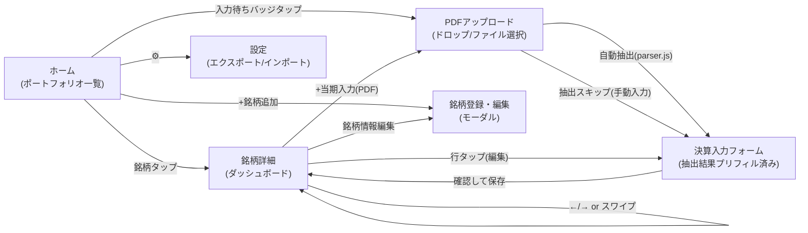

# 03. 提案仕様書

※ 前提: 決定済み **Q1-C(PDFアップロード)/ Q2-A(Chart.js)/ Q4-A(株価手動)/ Q6-A(累計入力)** +
未決分は推奨案(Q3-A, Q5-A, Q7-A, Q8-A)。決定が変われば該当箇所を改訂する。

---

## 1. データ構造

localStorage に単一キー(`kessan-board-state-v1`)で以下のJSONツリーを保存する。
TaskChute Journal と同じく「バージョン付き単一ステート+マイグレーション関数」方式。

```jsonc
{
  "version": 1,
  "settings": {
    "theme": "dark",            // "dark" | "light" | "auto"
    "defaultPeriods": 8         // 標準表示期数(8 | 12 | 0=全期間)
  },
  "companies": [
    {
      "id": "c_7203",           // 内部ID(証券コード基点で採番)
      "code": "7203",           // 証券コード
      "name": "トヨタ自動車",
      "sector": "輸送用機器",    // 自由入力+入力済み値のサジェスト
      "market": "プライム",
      "tags": ["保有"],          // "保有" | "監視" 等の自由タグ
      "fiscalYearEnd": 3,        // 決算月(1〜12)
      "nextEarningsDate": "2026-08-05",  // 次回決算予定日(手動、null可)
      "memo": "",
      "createdAt": "2026-07-02T09:00:00+09:00"
    }
  ],
  "records": [
    {
      "id": "r_7203_2027Q1",
      "companyId": "c_7203",
      "fiscalYear": 2027,        // 会計年度(2027年3月期 → 2027)
      "quarter": 1,              // 1〜4(4 = 本決算)
      // ---- 短信サマリーからの転記(すべて累計値、単位: 百万円) ----
      "pl": {
        "sales": null,           // 売上高
        "operatingIncome": null, // 営業利益
        "ordinaryIncome": null,  // 経常利益(任意)
        "netIncome": null        // 親会社株主に帰属する当期純利益
      },
      "cf": {
        "operatingCF": null      // 営業CF(累計)。Q1/Q3非開示の会社はnull可
      },
      "bs": {
        "totalAssets": null,     // 総資産
        "equity": null,          // 自己資本(純資産-非支配持分等)
        "interestBearingDebt": null // 有利子負債(任意。短信に無ければBS本表から)
      },
      "shares": {
        "outstanding": null      // 期末発行済株式数(自己株控除後、株)
      },
      "forecast": {              // 通期予想(Q7-A採用時)
        "sales": null,
        "operatingIncome": null,
        "netIncome": null,
        "dividend": null,        // 年間配当(円)
        "revised": false         // 今回開示で予想修正があったか
      },
      "market": {                // 任意(Q4-A採用時)
        "price": null,           // 株価(円)
        "priceDate": null
      },
      "note": "",
      "updatedAt": "2026-08-06T21:00:00+09:00"
    }
  ]
}
```

### 設計ポリシー

- **入力は累計値のみ**(Q6-A)。単四半期値・全指標は表示時に毎回算出し、**保存しない**
  (二重管理による不整合を構造的に排除。データ量的に再計算コストは無視できる)
- 全数値フィールドは `null` 許容。未入力項目があっても算出可能な指標だけ表示し、
  不能な指標は「—」表示(入力を途中保存しても壊れない)
- `id` は決定的に採番(`r_{code}_{FY}Q{q}`)し、同一期の重複登録をキー衝突で防ぐ

### 単四半期値の導出

```
単Q値(FY, q) = 累計値(FY, q) − 累計値(FY, q−1)     // q ≥ 2
単Q値(FY, 1) = 累計値(FY, 1)
前期(q−1)が未入力の場合 → 単Q算出不能。グラフ・YoYは累計値ベースにフォールバック
```

---

## 2. 主要指標の定義式

すべて `metrics.js` の指標レジストリで定義する(§4)。単位・桁は表示層で整形。

### 2.1 規模・成長(単四半期ベース)

| 指標 | 定義式 | 表示 |
|---|---|---|
| 売上高 単Q | 上記導出 | 百万円、棒グラフ |
| 営業利益 単Q | 同上 | 百万円、棒グラフ |
| 純利益 単Q | 同上 | 百万円 |
| 売上高 YoY | (単Q − 前年同期単Q) ÷ &#124;前年同期単Q&#124; | %、テーブル色分け |
| 営業利益 YoY | 同上 | % |
| 純利益 YoY | 同上 | % |
| EPS(TTM) | 純利益(直近4Q合計) ÷ 期末発行済株式数 | 円 |

> YoYの分母は絶対値を取る(前年同期が赤字の場合の符号反転を防ぐ)。
> 前年同期が0またはnullの場合は「—」。

### 2.2 収益性・効率

| 指標 | 定義式 | 表示 |
|---|---|---|
| 営業利益率(単Q) | 営業利益単Q ÷ 売上高単Q | %、折れ線(チャート第2軸) |
| 純利益率(単Q) | 純利益単Q ÷ 売上高単Q | % |
| ROE(TTM) | 純利益(直近4Q合計) ÷ 自己資本(最新期末) | % |

> ROEは四半期ごとの年率換算ブレを避けるためTTM(直近12ヶ月)で統一。
> 直近4Qが揃わない期間は「—」。

### 2.3 財務健全性・利益の質

| 指標 | 定義式 | 表示 |
|---|---|---|
| 自己資本比率 | 自己資本 ÷ 総資産 | %、折れ線 |
| 有利子負債/自己資本(D/E) | 有利子負債 ÷ 自己資本 | 倍 |
| 営業CF(TTM) | 営業CF直近4Q合計(累計差分から算出) | 百万円 |
| CF/利益比率(アクルーアル) | 営業CF(TTM) ÷ 純利益(TTM) | 倍。1.0未満が続くと利益の質に黄信号 |

> 営業CFを半期でしか開示しない会社は、Q1/Q3のCF系指標を自動スキップ(「—」表示、警告対象外)。

### 2.4 予想・進捗(Q7-A)

| 指標 | 定義式 | 表示 |
|---|---|---|
| 進捗率(純利益) | 累計純利益 ÷ 通期予想純利益 | %。基準線: Q1=25% / Q2=50% / Q3=75% |
| 進捗率(営業利益) | 同上 | % |
| 予想修正 | `forecast.revised` フラグ+前回入力予想との差分 | 上方↑/下方↓バッジ |

### 2.5 バリュエーション(Q4-A、株価入力時のみ)

| 指標 | 定義式 |
|---|---|
| 時価総額 | 株価 × 発行済株式数 |
| PER | 株価 ÷ EPS(TTM) |
| PBR | 株価 ÷ (自己資本 ÷ 発行済株式数) |
| 配当利回り | 年間配当予想 ÷ 株価 |

---

## 3. 画面構成・遷移

### 3.1 画面遷移図



画面は実質2枚(ホーム/銘柄詳細)+モーダル3種(アップロード→フォームは同一モーダル内の2ステップ)。
タブバー等は設けない。

### 3.2 ホーム(ポートフォリオ一覧)

「開いた瞬間に、要注意銘柄と入力待ちが分かる」ことに特化。

```
┌────────────────────────────────────────────────┐
│ Kessan Board          [検索🔍] [タグ▼] [＋] [⚙] │
├────────────────────────────────────────────────┤
│ ⏳ 入力待ち: トヨタ(8/5発表) ソニーG(8/7発表)      │ ← nextEarningsDate ≤ 今日 かつ 当期未入力
├────────────────────────────────────────────────┤
│ 銘柄       期    売上YoY 営利YoY 営利率 ROE  進捗 ⚠ │
│ トヨタ     27Q1  +8.2%  +12.1%  11.3% 15.2% 28% │ ← YoYセルは緑↔赤の背景色(ヒートマップ)
│ ソニーG    27Q1  +3.1%  ▲4.2%   9.8%  13.1% 22% │
│ ◯◯商事   27Q1  ▲2.0%  ▲15.3%  6.1%  9.8%  18% 🔴│ ← 赤信号バッジ(タップで理由表示)
└────────────────────────────────────────────────┘
```

- 行タップ → 銘柄詳細へ
- 一覧の表示指標は5列固定(MVP)。列カスタマイズはP2以降の検討
- ソート: 銘柄コード / 赤信号優先 / 直近入力順

### 3.3 銘柄詳細(ダッシュボード) — iPad横持ち2カラム

```
┌──────────────────────────────────────────────────────┐
│ ← 7203 トヨタ自動車  [保有] 3月期   [＋当期入力] [✎]  │
├──────────────────────────────────────────────────────┤
│ ⚠ 赤信号: 営業CF/純利益が2期連続で0.8未満              │ ← 該当時のみ
├───────────────────────────┬──────────────────────────┤
│ KPIカード(最新期)          │ 期次テーブル(新しい期が上) │
│ ┌────┬────┬────┬────┐    │ 期   売上  営利  純利  ...│
│ │売上 │営利 │営利率│ROE │    │ 27Q1 ...  ...  ...      │
│ │+8.2%│+12% │11.3%│15.2%│   │ 26Q4 ...  ...  ...      │
│ └────┴────┴────┴────┘    │ 26Q3 ...  ...  ...      │
│ 推移チャート(8期)▼12期 全  │ (行タップで編集)          │
│ ▐▌▐▌▐▌▐▌▐▌▐▌▐▌▐▌ ←棒:売上/営利│ 表示: 単Q / 累計 切替    │
│ ─────────────── ←線:営利率  │                          │
│ 第2チャート: 自己資本比率/CF │ [CSV] [印刷]             │
└───────────────────────────┴──────────────────────────┘
```

- KPIカード: 値+YoY矢印。タップでそのカードの指標をチャートに反映(重ね描き切替)
- チャート凡例タップで系列のオン/オフ(Chart.js標準機能)
- iPhone時は縦積み1カラムにレスポンシブ

### 3.4 決算入力モーダル(2ステップ)

**ステップ1: PDFアップロード**

- 短信PDFをドラッグ&ドロップ / ファイル選択(iPadは「ファイル」アプリ経由)
- `parser.js` がサマリーページを解析し、抽出結果を持ってステップ2へ自動遷移
- 「抽出をスキップして手動入力」リンクを常設(パーサー不調時の逃げ道)

**ステップ2: 確認・保存フォーム**(抽出結果がプリフィルされた入力フォーム)

- 銘柄と期(FY/Q)は PDF から自動判定、失敗時は未入力の次の期を提案
- 抽出できた欄は値+**抽出元テキストのツールチップ**付きで表示、
  抽出できなかった欄は空欄+ハイライト(ここだけ手で埋める)
- 各欄の**下に前年同期の値をグレー表示** → 桁ズレ・抽出ミスに即気付ける
- 前年同期比±50%超の欄は自動で注意ハイライト(抽出ミスの典型パターン検知)
- 欄の並びは短信サマリーの記載順(売上→営業利益→経常→純利益→BS→CF→予想)
- 単位は百万円固定(短信と同じ)。カンマ自動挿入
- `Enter`で次欄、最終欄で「確認して保存」。途中保存可(null許容)
- 既存期を開いた場合は同フォームが編集モードになる(PDFステップは飛ばす)。
  削除ボタン(確認ダイアログ付き)も同モーダル内

### 3.5 PDF自動抽出仕様(`parser.js`)

**方式:** pdf.js でテキスト+座標を取り出し、ラベル辞書×数値パターンのマッチングで
サマリーページの値を抽出する。**抽出値は直接保存せず、必ずステップ2の確認を通す。**

```
PDF → pdf.js: ページごとの textItem(文字列+x,y座標) を取得
  → 1〜2ページ目(サマリー)を対象に行復元(y座標でグルーピング)
  → ラベル辞書とマッチした行から数値を抽出
  → { field: { value, sourceText, page } } を返す(未検出フィールドは省略)
```

**ラベル辞書(初期セット、`parser.js` 内で一元管理):**

| フィールド | ラベルパターン(例) |
|---|---|
| pl.sales | `売上高` `営業収益` `売上収益` |
| pl.operatingIncome | `営業利益` |
| pl.ordinaryIncome | `経常利益` `税引前利益` |
| pl.netIncome | `親会社株主に帰属する当期純利益` `親会社の所有者に帰属する四半期利益` 等 |
| cf.operatingCF | `営業活動によるキャッシュ・フロー` |
| bs.totalAssets | `総資産` `資産合計` |
| bs.equity | `自己資本` `純資産` (自己資本比率行からの逆算も併用) |
| shares.outstanding | `期末発行済株式数(自己株式を含む)`+`期末自己株式数`(差引) |
| forecast.* | `通期` 行配下の各項目 |
| メタ | 表紙の `20XX年X月期 第X四半期決算短信` から FY/Q、`コード番号` から証券コード |

**数値の正規化ルール:**

- カンマ除去、`△`/`▲`/`(...)` → 負数
- 単位判定: 表内の `(百万円)` `(千円)` `(円)` 表記を検出し百万円に統一換算
- パーセント行(YoY併記)と金額の混在は「金額列の位置(x座標)」で切り分け

**運用上の割り切り:**

- 東証の短信サマリーは様式がほぼ共通のため、主要フィールドの抽出率は高い見込み。
  ただし**銘柄ごとの初回アップロード時に必ず全欄を目視確認**する(運用ガイド参照)
- IFRS/米国基準など勘定科目名が異なる場合はラベル辞書に別名を追加して対応
  (P1でアプリ内から別名登録できる簡易メンテUIを用意)
- 抽出率が低い銘柄は「スキップして手動入力」で運用継続できる=パーサーは
  あくまで高速化装置であり、信頼性の要件は確認フォーム側が担う

---

## 4. 拡張ポイント: 指標レジストリ(`metrics.js`)

新指標の追加を「1エントリ追加」で完結させる。

```js
// metrics.js — 指標定義レジストリ
export const METRICS = [
  {
    id: "opMargin",
    label: "営業利益率",
    group: "profitability",        // 表示グループ
    format: "percent1",            // 小数1桁%
    chart: { type: "line", axis: "right" },
    // ctx: { q, prevQ, yoyQ, ttm, company } — 算出済みの単Q/累計/TTM値へアクセス
    compute: (ctx) => ratio(ctx.q.operatingIncome, ctx.q.sales),
    alert: {                        // 赤信号ルール(任意)
      test: (series) => isDecliningStreak(series, 2),
      message: "営業利益率が2期連続で悪化",
      level: "warn"                 // "warn"(黄) | "danger"(赤)
    }
  },
  // ... 指標を追加する時はここにエントリを足すだけ
];
```

- ダッシュボード・一覧・CSV出力・警告判定はすべてこのレジストリを走査して描画する
- 将来の「セクタ別テンプレート」は `templates = { 銀行: [id...], 小売: [id...] }` として
  レジストリの部分集合を選ぶだけで実現できる構造にしておく(MVPでは未実装)

---

## 5. 赤信号(自動警告)ルール — MVP初期セット

| ルール | 条件 | レベル |
|---|---|---|
| 営業CF赤字 | 営業CF(TTM) < 0 | 🔴 danger |
| 利益の質 | CF/利益比率(TTM) < 0.8 が2期連続 | 🟡 warn |
| 営業減益トレンド | 営業利益単Q YoY < 0 が2期連続 | 🟡 warn |
| 増収減益 | 売上YoY > 0 かつ 営業利益YoY < ▲5% | 🟡 warn |
| 財務悪化 | 自己資本比率 < 30% または 前年同期比▲5pt超 | 🔴 danger |
| 進捗未達 | 進捗率(純利益)が基準線▲10pt超の未達 | 🟡 warn |
| 下方修正 | 予想修正で純利益予想が減額 | 🔴 danger |

- 判定に必要なデータが欠けている場合は「発火しない」(誤警報より沈黙を優先)
- しきい値は `metrics.js` 内の定数として一箇所にまとめ、運用しながら調整する

---

## 6. 入出力仕様

### 6.1 JSONエクスポート / インポート(必須・バックアップ用)

- エクスポート: ステート全体を整形JSONでダウンロード。
  ファイル名 `kessan-board_YYYY-MM-DD.json`
- インポート: バージョン検査+スキーマ簡易検証 → **全置換**(TaskChute Journalと同方式)。
  実行前に現行データの自動エクスポートを促す確認ダイアログ
- このJSONがクラウド移行・外部ツール連携(手元のPythonスクリプト等)の共通フォーマットになる

### 6.2 CSVエクスポート

- 銘柄単位: 1行=1期、列=生データ+全算出指標(Excel/Numbersでの追加分析用)
- 全体: 1行=銘柄×期のロング形式
- 文字コード UTF-8(BOM付き、Excel互換)

### 6.3 印刷(P2)

- 銘柄詳細に印刷用CSS(`@media print`)を用意し、1銘柄=A4縦1枚のレポートに整形
- ブラウザの「印刷→PDF保存」で完結。専用PNG出力機能は作らない

---

## 7. 非機能要件

| 項目 | 目標 |
|---|---|
| 初期表示 | < 1秒(静的ファイル+localStorage読込のみ) |
| 想定規模 | 〜30銘柄 × 40期(10年) ≒ ステート数百KB |
| オフライン | PWA。service workerでアプリシェルをキャッシュ |
| 対応環境 | iPad Safari(第一)、iPhone Safari、PC Chrome/Edge |
| データ保全 | エクスポートJSONのみが正式バックアップ。運用ガイドで四半期ごとの取得を必須化 |
| アクセシビリティ | ダークモード標準、色分けは色+記号(▲/＋)併用で色覚多様性に配慮 |
